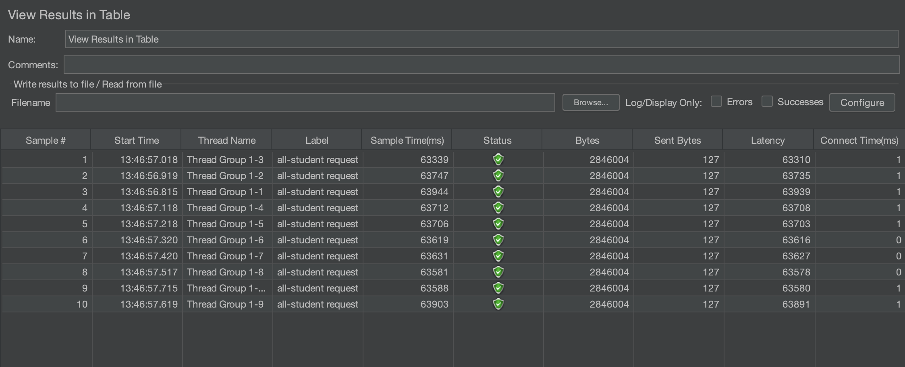
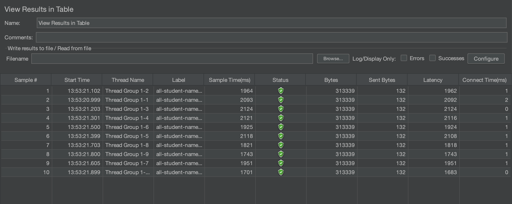
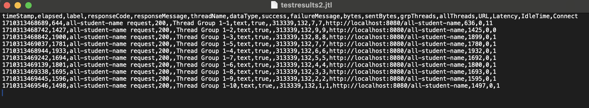
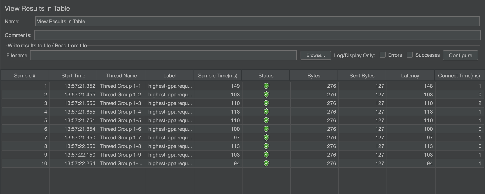
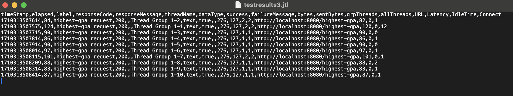

# Tutorial 5

---

Fikri Risyad Indratno 
2206031170 
Advanced Programming B 

---

### JMeter pre-optimized results
#### /all-student

#### /all-student-name

#### /highest-gpa

### JMeter post-optimized results
#### /all-student

#### /all-student-name

#### /highest-gpa

### Conclusion

After doing some optimization, I've managed to improve the time it takes to request to endpoints, especially in 
`/all-student` and `/all-student-name`. Before optimization, the sampler takes about 60000-63000ms to complete a request
for `/all-student` endpoint, 1500-2000ms for `/all-student-name` endpoint, and 70-90 for `/highest-gpa endpoint`. After
optimization, the sampler takes about 4500ms to complete a request for `/all-student` endpoint, 60-90ms for `/all-student-name`
endpoint, and 60-90ms for `/highest-gpa` endpoint.

## Reflection

> What is the difference between the approach of performance testing with JMeter and profiling with IntelliJ Profiler 
> in the context of optimizing application performance?

**JMeter**: 
JMeter can be used to measure our application’s performance under different conditions and load behaviors. We can 
simulate real life situations where large amount of users trying to access the application.

**Intellij Profiler**: 
IntelliJ Profiler can be used to analyze and observer issues on code-level performance. We can pinpoint inefficient 
code and improve it to perform better.

> How does the profiling process help you in identifying and understanding the weak points in your application?

Profiling helps me by pointing parts of the code that takes a lot of time to finish the task. From there, I can optimize
the code to make it more efficient.

> Do you think IntelliJ Profiler is effective in assisting you to analyze and identify bottlenecks in your application code?

Yes, I think it's effective. IntelliJ Profiler provides a flame graph to help us find methods that use a lot of resources 
and time.

> What are the main challenges you face when conducting performance testing and profiling, and how do you overcome these 
> challenges?

After finishing this tutorial, I think the main challenge is setting up JMeter, because I'm not familiar with the tools.
I've overcome this challenge by reading the module before the tutorial and trying to read some references online.

> What are the main benefits you gain from using IntelliJ Profiler for profiling your application code?

The main benefit is having a tool that can analyze codes and pinpoint inefficient codes without having to use or
install other third-party applications.

> How do you handle situations where the results from profiling with IntelliJ Profiler are not entirely consistent with
> findings from performance testing using JMeter

I will check the configuration for both JMeter and IntelliJ Profiler, and then run the tests a couple of times and see
if the situation is resolved.

> What strategies do you implement in optimizing application code after analyzing results from performance testing and 
> profiling? How do you ensure the changes you make do not affect the application's functionality?

First, I try to optimize the method and then check if the method returns the same output as before optimization, so this
will ensure that the method's functionality has not changed. After that, I try to run the program with profiler and JMeter
to see if the new method is more efficient or not.